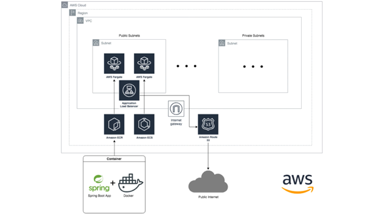

# AWS ECS Fargate - Spring Boot App

![API Infastructure] 


Let's take a look at what we're going to build here. To start with, we're going to first implement our VPC infrastructure that can be see with the outer frame.  That will include networking for private subnets, public subnets, route tables, network access control lists and actual routes for networking, Internet Gateway, Nat'l Gateway and everything. 

Once we have our subnets, we'll be able to implement our ECS cluster. And to do that, we're going to first create a repository, which is a elastic container registry for ECS. After that, we're going to start building our application and then going to implement the deployment script for our application using TerraForm. On top of those, we will deploy our load balancer for our application to balance itself with the container workloads.

We're going to create a DNS record and create ourselves a domain. Dockerizing the spring boot application and pushing it to ECR. And with that help, we will be able to have it up and running on ECS.

And finally, once we bind domain to our ECS application, we'll be able to reach it from the public internet.


### Prerequisites
- AWS account with programatic access
- [AWS CLI](https://aws.amazon.com/cli/) must be installed
- Domain name in Route 53  

## STEP 1

### Virtual Private Cloud (VPC) Network Infrastructure 
- Create S3 Bucket for Terraform Remote State
- Create Project
- Define remote state configuration
- Create a VPC
- Create Public Subnets
- Create Private Subnets
- Create route table for public routes
- Create route table for private routes
- Associate route table with subnets
- Create an elastic IP for NAT Gateway
- Create NAT Gateway and add to route table
- Create Internet Gateway (IGW) and add to route table
- Output variables for remote state reading


### Execute terraform
`terraform init -backend-config="infrastructure-prod.config"`  
`terraform plan -var-file="production.tfvars"`
`terraform apply -var-file="production.tfvars"`      

## STEP 2

### Elastic Container Services (ECS) Platform Infrastructure 
- Register a domain on Route53 for ECS platform
- Define Backend and Read Remote State for Layer 1 infrastructure
- Create ECS Cluster
- Create ALB with security groups for ECS cluster
- Create HTTPS Domain SSL Certificate and validate for ECS cluster
- Add Route53 Record for ALB Domain Name
- Create a default target group for ECS cluster
- Create an HTTPS ALB Listener for Load Balancer for ECS Cluster
- Create IAM Role for ECS Cluster
- Attach IAM Policy to ECS Cluster Role
- Output variables for remote state reading

### Execute terraform
`terraform init -backend-config="platform-prod.config"`  
`terraform plan -var-file="production.tfvars"`
`terraform apply -var-file="production.tfvars"` 

## STEP 3

### ECS Fargate Application Deployment
- Define Backend and Read Remote State for Layer 2 infrastructure
- Create ECS Task Definition
- Create IAM Task and execute role and policy for ECS Tasks
- Create security group for ECS Service
- Create ECS Service
- Create ALB Listener Rule for ECS Service
- Create CloudWatch Log group for ECS Service
- Provide Tfvars

## STEP 4

### Script the pipeline and deploy Fargate Spring Boot Application
- Create Dockerfile for App
- Create shell script for deployment
- Deployment stages for shell script
- Implement Code Build Stage
- Implement App dockerizing and AWS ECR Push
- Implement App deployment to ECS Fargate

### Building the code
`sh deploy.sh build`  

### Dockerizing the App and AWS ECR Push
`sh deploy.sh dockerize`

### Deploy App to ECS Fargate
`sh deploy.sh deploy`

## IMPORTANT

```
The path/URL to check the application is ("/test") 
```